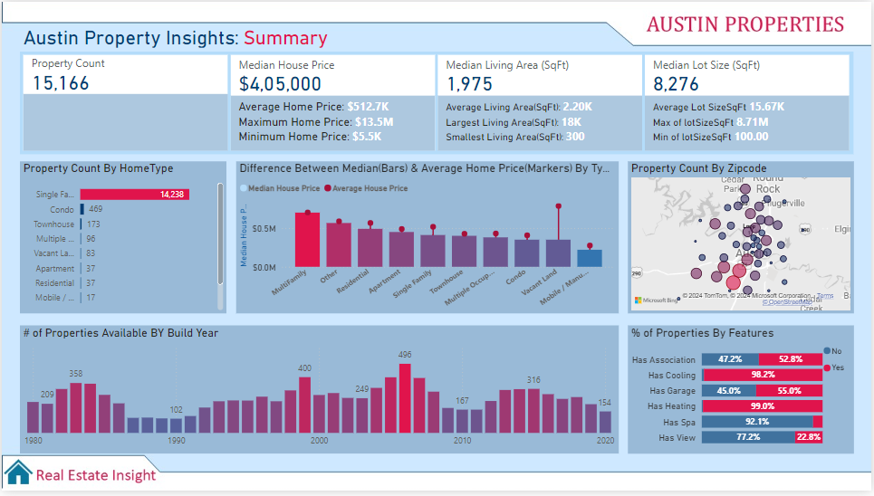
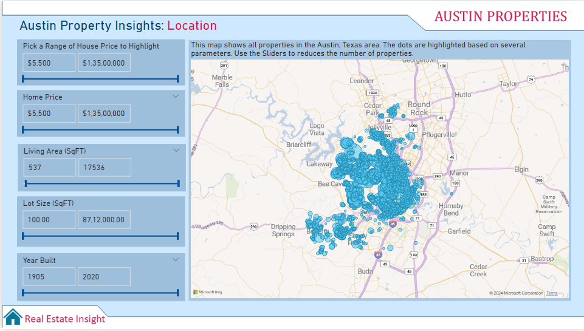
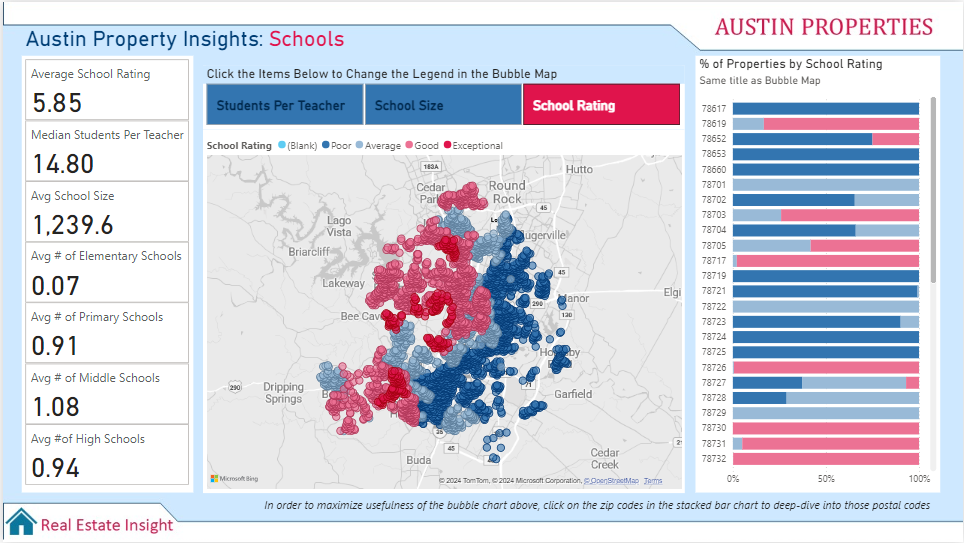

# Austin Property Insights Dashboard

This project offers a dynamic and immersive exploration of the Austin housing market, designed to empower buyers, real estate professionals, and policymakers with actionable insights. By delving deep into location data, school influences, and housing trends, it provides a comprehensive perspective on the factors shaping the market.

# Dashboard Summary

- It summarizes the property count, along with the maximum, minimum, average, and median values for house prices, living area, and lot size.

- It allows users to filter properties by home type, zipcode, build year, and features.

- It offers an interactive map to effortlessly guide you in finding the ideal properties for your search.

- It evaluates Austin, Texas properties based on the proximity to schools, helping you find communities that align with your family’s educational preferences.

# Dashboard Preview

# Conclusion
In conclusion, this project provides an interactive platform for exploring the Austin housing market, offering insights into property locations, school proximity, and personalized filters. The interactive map and customizable options make it easier for users to find properties that match their preferences. It serves as a valuable tool for buyers, real estate professionals, and policymakers to make informed decisions in the Austin real estate market.

